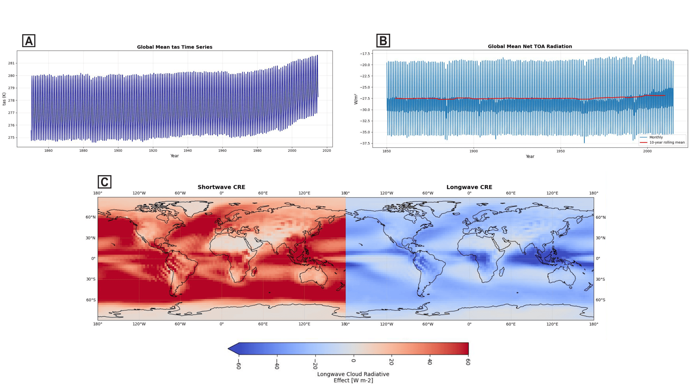
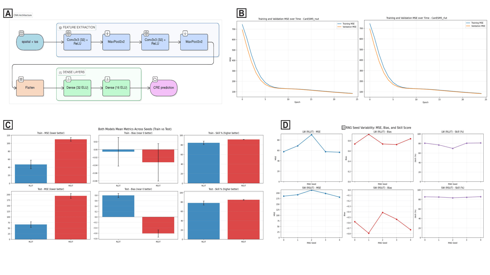
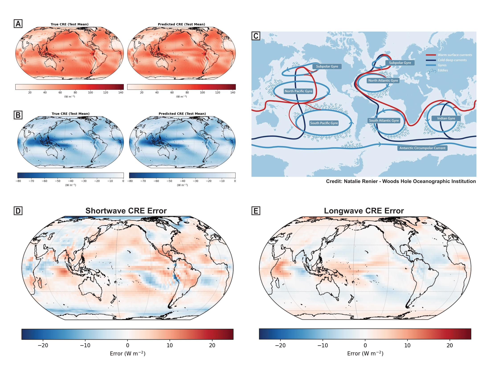

# Predicting the cloud radiative effect from sea surface temperatures

## The Team
* **Altti:** Undergraduate student. Interested in climate and its connection to events and life across history. Project focus on creating dataset splits and training the model.
* **David:** Graduate student. Interested in evolution of earth system and life. Project focus on model selection and conceptualization, and maintaining the GitHub repository.
* **Filip:** Undergraduate student. Interested in sedimentary geology and paleobiology. Project focus on creating figures and visualizations of data.
* **Justin:** Undergraduate student. Interested in future climate change and its effects on extreme weather, ocean life. Project focus on data cleaning and organization.
* **Manali:** Graduate student. Interested in the role of the ocean in global climate change. Project focus in data acquisition and guiding science questions.

## Introduction
An ongoing focus of the climate community is to improve estimates of climate sensitivity, or how much the Earth's surface will warm in response to increasing greenhouse gas (GHG) concentrations. Many studies over the past decade have shown evidence that the feedbacks governing Earth's radiative response to warming is governed by the spatial pattern of warming (commonly called the "pattern effect"). Particularly, since the 1800s, warming has been relatively slow in regions including the eastern tropical Pacific and Southern Ocean, but these regions are expected to warm more than the global mean in the long term, thus increasing climate sensitivity.

Improving our understanding of the sea surface temperature (SST) controls on the top-of-atmosphere (TOA) radiative response is critical to constraining future warming projections. Among several studies that have attempted to do this, we focus on a recent study by [Rugenstein et al. (2025)](https://agupubs.onlinelibrary.wiley.com/doi/full/10.1029/2024GL109581) which uses a convolutional neural network (CNN) to learn the pattern effect and predict the future radiative response from historical SSTs.

## Background

### Atmospheric radiation and surface temperature

*Figure 1. Earth energy budget and radiation*

**Total energy in the Earth system = Incoming energy + Outgoing energy,**

where incoming energy may be considered to be positive, and outgoing, negative.
Energy is mainly categorized as
* **Shortwave (SW) from the sun:** ~30% reflected back to space by clouds. ~70% absorbed by Earth’s surface
* **Longwave (LW) from Earth:** Earth’s surface and atmosphere emit longwave radiation upon warming.

*Greenhouse effect:* When excess greenhouse gases trap longwave radiation and direct it back to the Earth’s surface, there is an imbalance in the radiation budget at the TOA as incoming energy > outgoing energy. Thus, the Earth’s surface must warm more in order to emit more LW and restore energy balance at the TOA.

### Cloud cover and its radaitive effect
Clouds have a crucial role in Earth’s energy budget:
* **Albedo effect** reflect incoming SW energy from the sun back to space, *cooling* the Earth
* **Greenhouse effect:** trap outgoing longwave energy at the TOA, *warming* the Earth

Which effect dominates can depend (among other factors) on the type of clouds, their height in the atmosphere, etc. For example, cumulus clouds that are low in the sky typically have an albedo effect while cirrus clouds that are higher up in the sky have a warming effect.

A metric used to quantify the net impact of clouds on the Earth's energy budget is defined as the *cloud radaitive effect (CRE)*. This is calculated from climate model as the difference between net TOA radiation in a *clear-sky* simulation (assuming an atmosphere with no clouds) from an *all-sky* simulation (assuming the atmosphere with the full cloud scheme):
**Cloud Radiative Effect (CRE) = All-sky radiation - clear-sky radiation**

### Machine learning (ML) to determine the CRE
Given the strong evidence that changing SST patterns control both local and remote radiation, [Rugenstein et al. (2025)](https://agupubs.onlinelibrary.wiley.com/doi/full/10.1029/2024GL109581) have further shown that a CNN can be trained on internal variability (time-varying near-surface temperature maps) to learn the relationship between SST patterns and future global radiative response.

However, the CRE is associated with LW radiation through high clouds and with SW radiation through lower stratocumulus decks both of which may be governed by different SST patters. For this project, we ask
**Can a CNN trained on historical SST patterns predict the forced CRE in both the longwave and shortwave?**
If the CNN predicts the CRE in one wavelength regime better than the other, this would point to the source of the model's skill in learning the relationship between SSTs and radiation.

## Data

We use simulations from the Canadian Earth System Model version 5 (CanESM5) which participated in Phase 6 of the Coupled Model Intercomparison Project (CMIP6).

**Variables (netCDF4):**
* rlut, rlutcs (radiative longwave upwelling, all-sky and clear-sky)
* rsut, rsutcs (radaitive shortwave upwelling, all-sky, clear-sky)
* tas (near-surface air temperature)

LW CRE = rlut - rlutcs

SW CRE = rsut - rsutcs

**Dimensions:**
* members (25 realizations)
* time (monthly): 1850-2014 (*historical* simulations) for training and validation and 2015-2100 (*SSP2-4.5* simulation) for testing
* latitude (64) and longitude (128)

**Data Overview**

*Figure 2: CanESM5 historical climate data (1850-2014).(A) Global Mean Surface Air Temperature (tas) Time Series: Displays the evolution of global mean surface temperature dating 
back to 1850. This shows a clear positive trend especially post-1950. This demonstrates the primary input variable when it comes to 
understanding the sensitivity of the earth’s climate. (B) Global Mean Net Top-of-Atmosphere (TOA) Radiation: Displays the 
monthly and 10-year rolling mean net radiation balance at the TOA. There is a upward trend in the recent years that are important 
for training models on the earth’s energy balance. Patterns in both A and B suggest that a predictive model can be created. This is 
used to create the CRE datasets for the CNN model. (C) Spatial Distribution of Cloud Radiative Effects (CRE): Displays two 
global maps of shortwave (left) and longwave (right) CRE in W/m^2. The shortwave CRE map highlights the albedo effect being 
present in ocean regions. There are many clouds that reflect the shortwave radiation back into space which has a cooling effect on 
the earth’s surface. The longwave CRE map shows the greenhouse effect of clouds across the tropic regions. The high altitude 
areas being near the equator pushes clouds up high and therefore colder. This allows them to “trap” heat more effectively, reducing 
the amount of longwave radiation reaching space. This demonstrates the output or results that the CNN model forms when given 
input temperatures.*

## ML approach

### Model Architecture

We adapt the convolutional neural network (CNN) architecture from [Rugenstein et al. (2025)](https://agupubs.onlinelibrary.wiley.com/doi/full/10.1029/2024GL109581) to predict both shortwave and longwave CRE independently from historical SST patterns.

### Training Strategy

- **Data splitting:** We separated the 25 ensemble members into training (70%, 1850-2014), validation (15%, 1850-2014), and test (15%, 2015-2100) splits

- **Model architecture:** 
  - Input: global 2D near-surface air temperature (tas) maps
  - Feature extraction: Two 3×3 convolutional layers with ReLU activation, each producing 32 feature maps, followed by 2×2 max pooling to reduce dimensionality
  - Fully connected layers: 32 neurons (ELU activation) → 16 neurons (ELU activation) → CRE prediction
  - Note: ELU activation improves convergence but may contribute to observed overfitting

- **Loss function and optimization:** Mean squared error (MSE) loss; Adam optimizer; trained for 25 epochs showing rapid initial convergence followed by plateau, minimizing risk of early overfitting

- **Ensemble approach:** All 25 ensemble members were pooled for training; temporal split ensures independence between train/validation/test sets

- **Model stability:** Assessed across 5 random seeds; MSE, bias, and skill scores show robust performance across different weight initializations, indicating stable learned relationships (Figure 3).

*Figure 3:  Model Architecture and Evaluation
(A) CNN Architecture: Shows the structure and process of the Convolutional Neural Network. The model takes near surface temperature (tas) 
as input, these pass through two 3x3 Convolutional layers using ReLU activation creating 32 feature maps each, then a 2x2 Max Pooling layers 
reduces dimensionality. The final feature maps are then flattened and passed through the fully connected layer with 32-neuron and 16-neuron 
using ELU activation these then output the Cloud Radiative Effect (CRE) prediction. While the ELU activation is used to improve convergence 
and prevent dead neurons, it may be one culprit of the overfitting we see later.
(B) Training and Validation Loss over Time: Mean Squared Error curves for both the shortwave (rsut) and longwave (rlut) models for the first 
random seed over time. The graphs show both the training and validation MSE across the first 25 epochs. Both curves initially show a fast 
decline and then a slow convergence, ensuring that the model will be able learn the connection between temperature and CRE without already 
overfitting in the beginning steps. 
(C) Both Models Mean Metrics (Train vs Test): 3 bar charts comparing the training and testing performance as well as between longwave and 
shortwave models. Unfortunately, we do find overfitting as testing MSE is over 50% higher than training MSE and bias is around 0 for training 
vs 0.8 and -0.6 for longwave and shortwave respectively. Looking at skill score, both models still to much better than baseline and do show the 
ability to learn the relationship. Finally, we can see a clear comparison as longwave predictions have much lower MSE compared to shortwave, 
which will be explored further,
(D) RNG Seed Variability: 3 line graphs showing the variability of the model's performance across 5 different random seeds. By plotting the 
differences in MSE, Bias, and Skill Score for both longwave and shortwave models across different initial weights, it shows the stability of the 
CNN as this randomness does not dramatically change the resulting model..*

## Results

### Model Skill and Performance

Both the longwave (LW) and shortwave (SW) models demonstrate skill in predicting CRE from SST patterns, but with important differences:

- **Longwave CRE:** Lower test MSE (~150 W²/m⁴) compared to shortwave, with smaller bias (~0.8 W/m²) and higher skill score (~75% variance explained)
- **Shortwave CRE:** Higher test MSE (~170 W²/m⁴), larger bias (−0.6 W/m²), and lower skill (~60% variance explained)
- **Overfitting:** Both models show test MSE ~50% higher than training MSE, indicating regularization could be improved through larger training datasets or modified hyperparameters
- **Generalization:** Models maintain stable skill across 5 random seeds, indicating robust learned relationships despite overfitting

### Spatial Patterns and Regional Performance

The models capture global CRE patterns well but show systematic regional biases (Figure 4):

- **Shortwave errors:** Largest prediction errors occur at high latitudes and tropical regions (Central America, Indian Ocean), where regional cloud processes and ocean circulation features dominate
- **Longwave errors:** Generally smaller than shortwave, with notable discrepancies still present in the Indian Ocean; suggests longwave CRE is more globally coherent and less dependent on regional processes
- **Indian Ocean and Greenland:** Key error hotspots across both wavelengths, likely reflecting:
  - Complex ocean circulation dynamics (gyres, eddies) that SST patterns alone may not capture
  - Unresolved sub-grid-scale cloud processes in these dynamically active regions
  - Model biases in CanESM5's representation of these regions

### Wavelength Comparison

The CNN predicts longwave CRE substantially better than shortwave CRE, supporting the hypothesis that these radiation regimes involve different physical mechanisms:

- **Shortwave sensitivity:** Lower stratocumulus decks are highly sensitive to local ocean circulation and regional processes that create fine-scale SST gradients; the model struggles to capture these in data-sparse regions
- **Longwave response:** High cloud feedback to SST is more globally coherent; the spatial pattern of warming alone provides stronger predictive power for LW radiation changes
- **Implication:** Cloud feedbacks in future climate may be dominated by high-cloud responses (LW) that scale with the global warming pattern, while low-cloud responses (SW) remain model-dependent and regionalized

### Predictions vs. Observations

Figure 4 illustrates the spatial distribution of true and predicted CRE values across both wavelengths, along with detailed error maps. The model successfully reproduces the large-scale spatial patterns of both SW and LW CRE, capturing the prominent features such as oceanic albedo effects in the shortwave and upper-cloud greenhouse effects in the longwave. However, regional deviations reveal important constraints on the SST-CRE relationship.

*Figure 4:  Model outputs and errors. (A) True shortwave radiation cloud radiative effect (CRE) values, along with model-pre￾dicted shortwave radiation CRE values. (B) True longwave radiation CRE values, along with model-predicted CRE values. (C) 
A diagram depicting the major currents, gyres, and eddies that characterize ocean circulation around the globe. The behavior of 
these circulation features over time may be a source of error to our model, especially in regions such as the Indian Ocean. (D) 
Model error for shortwave radiation CRE. The largest errors are located around high latitudes, as well around tropical regions 
such as Central America and the Indian Ocean. (E) Model error for longwave radation CRE. The model produces less prediction 
error using longwave radiation than with shortwave radiation, likely because longwave radiation is less dependent on regional 
processes. However, regions such as the Indian Ocean still exhibit noticeable errors.
Panel (C) was illustrated by Natalie Renier and is sourced from the Woods Hole Oceanographic Institution. The original fgure 
can be found here: https://www.whoi.edu/ocean-learning-hub/multimedia/ocean-circulation-road-map/.*

## Discussion

### Wavelength Comparison

The CNN predicts longwave CRE substantially better than shortwave CRE, supporting the hypothesis that these radiation regimes involve fundamentally different physical mechanisms:

- **Shortwave sensitivity:** Lower stratocumulus decks are highly sensitive to local ocean circulation patterns and regional SST gradients. The model struggles most in dynamically complex regions (Indian Ocean, high latitudes) where the SST-cloud relationship is modulated by circulation features not explicitly captured in the input
- **Longwave response:** High-cloud feedback is more globally coherent and primarily driven by large-scale warming patterns. This simpler relationship allows the CNN to generalize more successfully
- **Climate implications:** Future cloud feedbacks may be governed primarily by broadly-positive high-cloud effects (LW) responding to the spatial pattern of warming, while regional low-cloud feedbacks (SW) will remain model-dependent and uncertain

### Physical Interpretation

### Testing with Eocene 56 Ma climatic data (a fun experiment) 

To test how the model performs in different conditions we used [DeepMIP](https://www.deepmip.org/) data from the Early Eocene (approx 56 Ma),

## Future work

- Expanding the training data set (more models and members).

- Trying other variables that can expand in previous research and simulations.

- Use latitudinal splits, maybe look into how training on tropics affects results.

- Using different time periods.

