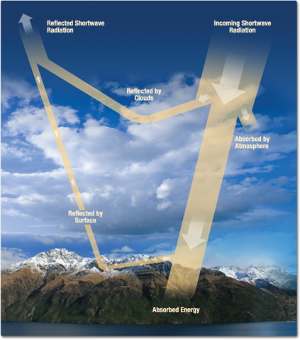

# Predicting the cloud radiative effect from sea surface temperatures

## The Team
* **Altti:** Undergraduate student. Interested in climate and its connection to events and life across history. Project focus on creating dataset splits and training the model.
* **David:** Graduate student. Interested in evolution of earth system and life. Project focus on model selection and conceptualization, and maintaining the GitHub repository.
* **Filip:** Undergraduate student. Interested in sedimentary geology and paleobiology. Project focus on creating figures and visualizations of data.
* **Justin:** Undergraduate student. Interested in future climate change and its effects on extreme weather, ocean life. Project focus on data cleaning and organization.
* **Manali:** Graduate student. Interested in the role of the ocean in global climate change. Project focus in data acquisition and guiding science questions.

## Introduction
An ongoing focus of the climate community is to improve estimates of climate sensitivity, or how much the Earth's surface will warm in response to increasing greenhouse gas (GHG) concentrations. Many studies over the past decade have shown evidence that the feedbacks governing Earth's radiative response to warming is governed by the spatial pattern of warming (commonly called the "pattern effect"). Particularly, since the 1800s, warming has been relatively slow in regions including the eastern tropical Pacific and Southern Ocean, but these regions are expected to warm more than the global mean in the long term, thus increasing climate sensitivity.

Improving our understanding of the sea surface temperature (SST) controls on the top-of-atmosphere (TOA) radiative response is critical to constraining future warming projections. Among several studies that have attempted to do this, we focus on a recent study by [Rugenstein et al. (2025)](https://agupubs.onlinelibrary.wiley.com/doi/full/10.1029/2024GL109581) which uses a convolutional neural network (CNN) to learn the pattern effect and predict the future radiative response from historical SSTs.

## Background

### Atmospheric radiation and surface temperature

**Total energy in the Earth system = Incoming energy + Outgoing energy,**

where incoming energy may be considered to be positive, and outgoing, negative.
Energy is mainly categorized as
* **Shortwave (SW) from the sun:** ~30% reflected back to space by clouds. ~70% absorbed by Earth’s surface
* **Longwave (LW) from Earth:** Earth’s surface and atmosphere emit longwave radiation upon warming.

*Greenhouse effect:* When excess greenhouse gases trap longwave radiation and direct it back to the Earth’s surface, there is an imbalance in the radiation budget at the TOA as incoming energy > outgoing energy. Thus, the Earth’s surface must warm more in order to emit more LW and restore energy balance at the TOA.

### Cloud cover and its radaitive effect
Clouds have a crucial role in Earth’s energy budget:
* **Albedo effect** reflect incoming SW energy from the sun back to space, *cooling* the Earth
* **Greenhouse effect:** trap outgoing longwave energy at the TOA, *warming* the Earth

Which effect dominates can depend (among other factors) on the type of clouds, their height in the atmosphere, etc. For example, cumulus clouds that are low in the sky typically have an albedo effect while cirrus clouds that are higher up in the sky have a warming effect.

A metric used to quantify the net impact of clouds on the Earth's energy budget is defined as the *cloud radaitive effect (CRE)*. This is calculated from climate model as the difference between net TOA radiation in a *clear-sky* simulation (assuming an atmosphere with no clouds) from an *all-sky* simulation (assuming the atmosphere with the full cloud scheme):
**Cloud Radiative Effect (CRE) = All-sky radiation - clear-sky radiation**

### Machine learning (ML) to determine the CRE
Given the strong evidence that changing SST patterns control both local and remote radiation, [Rugenstein et al. (2025)](https://agupubs.onlinelibrary.wiley.com/doi/full/10.1029/2024GL109581) have further shown that a CNN can be trained on internal variability (time-varying near-surface temperature maps) to learn the relationship between SST patterns and future global radiative response.

However, the CRE is associated with LW radiation through high clouds and with SW radiation through lower stratocumulus decks both of which may be governed by different SST patters. For this project, we ask
**Can a CNN trained on historical SST patterns predict the forced CRE in both the longwave and shortwave?**
If the CNN predicts the CRE in one wavelength regime better than the other, this would point to the source of the model's skill in learning the relationship between SSTs and radiation.

## Data

We use simulations from the Canadian Earth System Model version 5 (CanESM5) which participated in Phase 6 of the Coupled Model Intercomparison Project (CMIP6).

**Variables (netCDF4):**
* rlut, rlutcs (radiative longwave upwelling, all-sky and clear-sky)
* rsut, rsutcs (radaitive shortwave upwelling, all-sky, clear-sky)
* tas (near-surface air temperature)

LW CRE = rlut - rlutcs
SW CRE = rsut - rsutcs

**Dimensions:**
* members (25 realizations)
* time (monthly): 1850-2014 (*historical* simulations) for training and validation and 2015-2100 (*SSP2-4.5* simulation) for testing
* latitude (64) and longitude (128)

## ML approach

## Results

## Discussion

## Future work

